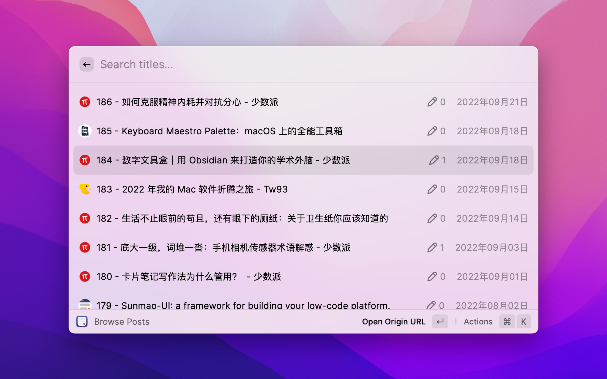
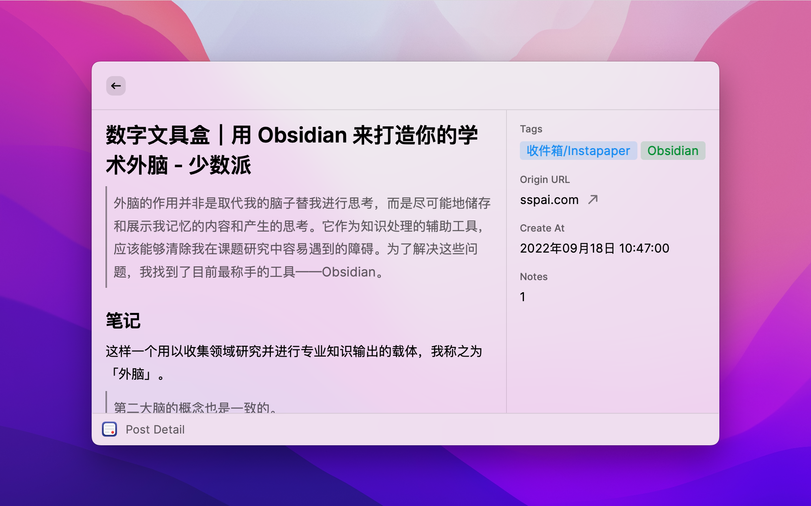
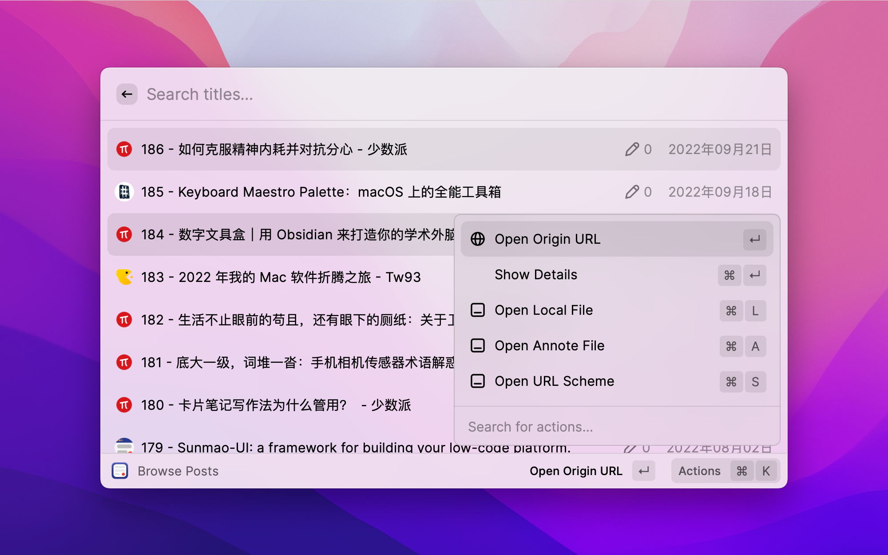

  

  <h1>
    SimpRead
  </h1>

  <h2>
    Search and open SimpRead Unreader
  </h2>
  
  

    
    
    
    
  

## SimpRead Unreader

Raycast extension for search and open [SimpRead Unreader](https://simpread.pro/pro.html)

## SimpRead

- [Website](https://simpread.pro)

- [Chrome Extension](https://chrome.google.com/webstore/detail/simpread-reader-view/ijllcpnolfcooahcekpamkbidhejabll)

- [Edge Addons](https://microsoftedge.microsoft.com/addons/detail/%E7%AE%80%E6%82%A6-simpread/clgdhlhfiocphghdkdbgdlmfaafccfmc?hl=zh-CN)

## Feature

1. <kbd>sr</kbd> Browse Posts

2. Show SimpRead annotating Details

3. Open local file

4. Open origin url

## Showcases

### Welcome

### Show Unreader

### Show Unrreader Detail

### Open Local/Annote File & Read Mode

### Setting SimpRead config Path

## Video

<video controls width="100%">
    <source src="https://user-images.githubusercontent.com/81074/143815314-e6270ced-93e7-4e14-a708-1ce26ba756e1.mp4"
            type="video/mp4">
</video>

## Help & Tutorial

- [SimpRead Discussions](https://github.com/Kenshin/simpread/discussions/3119)